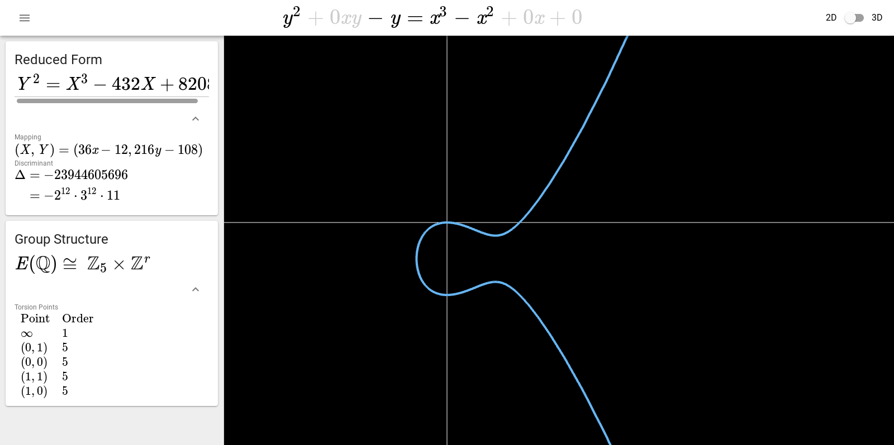
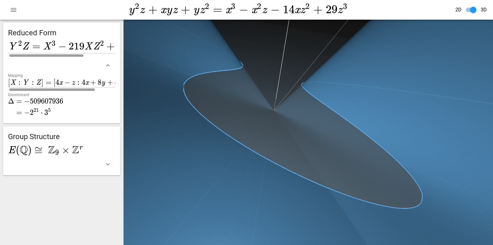

# Elliptic Curve Explorer 
An interactive [visualization](https://wgxli.github.io/elliptic-curve-explorer) of rational elliptic curves.

## Usage
* Scroll over or drag on the coefficients in the top bar to change the currently displayed elliptic curve.
* Clicking the icon in the upper left opens the information panel.

## Features
* Visualization in both 2D (affine) and 3D (projective) space.
* Computation of the torsion subgroup of the Mordell-Weil group.
